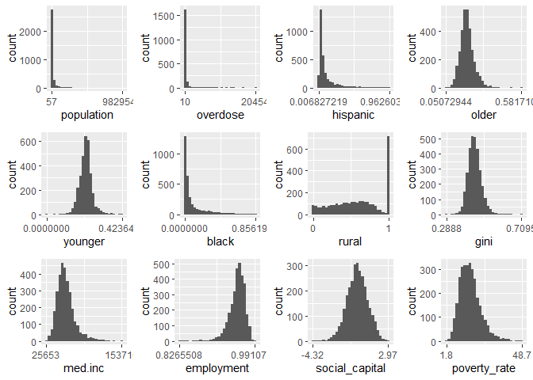

HLM Preprocessing
================
Paul Sylvia
2025-05-21

------------------------------------------------------------------------

## Preparation of the Level 1 Dataset

The Level 1 dataset is representative of nearly all US counties. The
study began by sourcing a few interesting county level datasets that now
need to be merged. These are primarily US census datasets, accessed
directly through the US census website and through the County Health
Rankings and Roadmaps website. In the second section, we will manipulate
and eventually bind an AHA National Survey dataset to create the fully
developed dataset.

Counties and hospitals both are clustered logically into Hospital
Referral Regions (HRRs). Unfortunately, these datasets don’t keep HRR as
a variable. To remedy this, we declare a cluster variable by
crosswalking county ID’s into HRR ID’s.

``` r
library.list <- c("dplyr", # For piping and data manipulation
                  "mice",  # Multivariate Imputation
                  "psych"  # Used for descriptive statistics: describe()
                  )

#Here we load packages from libary.list
for (i in 1:length(library.list)) {
  if (!library.list[i] %in% rownames(installed.packages())) {
    install.packages(library.list[i])
  }
  library(library.list[i], character.only = TRUE)}


county_dat <- read.csv('county_MH.csv') #County Health Rankings and Roadmaps dataset
social_capital <- read.csv('social_capital.csv') #A US census dataset. From here we will only be extracting the Putnam index.

#Both datasets are per US county. We merge them by FIPS county code abbreviations
social_capital$X5.digit.FIPS.Code <- social_capital$FIPS.Code
county_dat <- county_dat %>% right_join(social_capital, by = "X5.digit.FIPS.Code")

#Declaring an HRR ID variable#
HRR_county_crosswalk <- read.csv('HRR_county_crosswalk.csv') #This dataset declares HRRs to which counties belong.

county_dat$HRR <- HRR_county_crosswalk$hrr[match(county_dat$X5.digit.FIPS.Code, HRR_county_crosswalk$county)] #By use of the match() function we assign HRRs to each county in a new variable.
```

------------------------------------------------------------------------

The Linear Mixed Modeling analysis is interested in two research topics,
(1) the effect of socio-economic factors on substance-use related
overdose deaths and (2) the potential moderating effects of medical
treatments and hospital performance. So in the steps to follow, we
select the following types of variables: - Outcome variable (overdose
deaths) - Predictors (socio-economic variables) - Controls (demographic
variables).

Here is how the dataset looks so far,

    ## 
    ##  Number of cases:  3142 
    ##  Number of variables:  1011 
    ## 
    ##  A few examples of variable naming in the raw data (we will clean these up):

    ##  [1] "X.2.x"                       "X.1.x"                      
    ##  [3] "X.x"                         "X.3.x"                      
    ##  [5] "X.2.x.x"                     "X.1.x.x"                    
    ##  [7] "X.x.x"                       "State.FIPS.Code"            
    ##  [9] "County.FIPS.Code"            "X5.digit.FIPS.Code"         
    ## [11] "FIPS"                        "State.Abbreviation.x"       
    ## [13] "Name"                        "Release.Year"               
    ## [15] "County.Ranked..Yes.1.No.0."  "Premature.Death.raw.value"  
    ## [17] "Premature.Death.numerator"   "Premature.Death.denominator"
    ## [19] "Premature.Death.CI.low"      "Premature.Death.CI.high"

#### Cleaning variable names:

``` r
county_dat$population <- county_dat$Population.raw.value #This variable  will be applied to rescaling where necessary.

county_dat$overdose <- county_dat$overdose #This is the primary outcome variable.

#Socio-economic factors
county_dat$social_capital <- county_dat$Putnam
county_dat$poverty_rate <- county_dat$Poverty.rate.x
county_dat$med.inc <- county_dat$Median.Household.Income.raw.value
county_dat$unemployment <- county_dat$Unemployment.raw.value
county_dat$gini <- county_dat$gini 

#County-level Controls
county_dat$rural <- county_dat$X..Rural.raw.value
county_dat$black <- county_dat$X..Non.Hispanic.Black.raw.value
county_dat$hispanic <- county_dat$X..Hispanic.raw.value
county_dat$older <- county_dat$X..65.and.Older.raw.value
county_dat$younger <- county_dat$X..Below.18.Years.of.Age.raw.value

L1 <- county_dat %>%
  select(HRR, X5.digit.FIPS.Code, population, overdose, hispanic, older, younger,  
         black, rural, gini, med.inc, employment, social_capital, poverty_rate) %>%
  filter(is.na(HRR)==FALSE) #removes 2 cases with no crosswalk
```

#### Rescaling variables

In general, HLM requires variables to be on similar scales. In the next
few chunks, we identify poorly scaled variables and normalize them
(either 0-1 or SD=1).

``` r
library("ggplot2") #R's primary data visualization package
library("ggpubr") #'ggpubr' enables facet_wrapping of ggplots

for (i in 1:length(L1[,-c(1,2)])){
  name = names(L1)[i+2]
  min <- min(L1[,i+2],na.rm=TRUE)
  max <- max(L1[,i+2],na.rm=TRUE)
  graph <- ggplot(data = L1, aes(x=.data[[name]])) +
    geom_histogram() +
    xlim(c(min,max)) +
    scale_x_continuous(breaks = c(min, max))
  assign(paste("graph_", i, sep=""), graph)
}

print(ggarrange(graph_1, graph_2, graph_3, graph_4, graph_5, graph_6, 
          graph_7, graph_8, graph_9, graph_10, graph_11, graph_12))
```

<!-- -->

There is a lot to notice here. For now, we focus on the scaling issue
and find that poverty_rate, med.inc and overdose are all on much larger
scales than the rest of the dataset:

``` r
L1$overdose <- L1$overdose/L1$population #We scale values down to get overdoses per captia which also controls for population size.
L1$poverty_rate <- L1$poverty_rate/100 #Original values are percentages (0-100), so we scale down to get proportions (0-1).
L1$med.inc <- as.numeric(scale(L1$med.inc)) #Original values are in the tens of thousands. We apply normalization to power-down the variable.
```

Another issue beyond a variable’s overall scale is interpretability. We
wish to ensure that a one-unit change in x is interpretable for each x.
For some vars, this is obvious. A one-unit change in hispanic, for
example, is equivalent to going from no hispanic individuals in a county
to a county that is 100% hispanic; both such counties exist in the
dataset. But we will be ignoring demographic variables and instead take
a closer look at the gini index and employment. In neither case is 0
meaningful, nor is 1 meaningful for gini. One option is to normalize
them, but we will take the following approach instead which sets the
smallest value to 0 and the largest value to 1. So moving from 0 to 1 is
equivalent to going to the smallest plausible value to the largest.

``` r
L1$employment <- (L1$employment-min(L1$employment, na.rm=TRUE))/(max(L1$employment, na.rm=TRUE)-min(L1$employment, na.rm=TRUE))

L1$gini <- (L1$gini-min(L1$gini, na.rm=TRUE))/(max(L1$gini, na.rm=TRUE)-min(L1$gini, na.rm=TRUE))
```

Now that the dataset is more sensible for running analyses, we can apply
sophisticated approaches for missing data. In this case, we wish to
avoid imputing implausible values to certain variables, so we implement
predictive mean matching. The approach of PPM is to impute missing data
based on the values taken by other similar cases, thus avoiding
returning values outside the range of plausible values.

``` r
imp <- mice(L1[,c(3:14)], method="pmm", m = 1, maxit = 10, seed = 123,print=FALSE) ##Imputation through predictive mean matching
```

    ## Amount of missing data imputed:  0.036 
    ##  Missing data after imputation:  0

We now have a clean, appropriately scaled and complete dataset. But
before we say the Level 1 dataset has been finalized, we should address
two remaining issues.

1)  Each and every county needs to have a cluster match at the second
    level, so we find and delete any cases where this isn’t true:

``` r
#First we prepare the L2 dataset
hospital_data <- read.csv('hospital_data_23.csv') %>% ##AHA Survey Dataset (for Level-2 vars)
  filter(is.na(ALCHBD)==FALSE) ##rm hospitals that did not report
hospital_data$HRR <- HRR_county_crosswalk$hrr[match(hospital_data$FCOUNTY, HRR_county_crosswalk$county)] #By use of the match() function we assign HRRs to each hospital in a new variable (this is the same as chunk 1).

#Then we follow a procedure to identify and remove remove bad cases.
temp <- unique(L1_imp$HRR)[is.na(match(unique(L1_imp$HRR), unique(hospital_data$HRR)))] #By using the unique() and match() functions, we identify L1 HRRs that exist in the L2 dataset.
L1_imp_filt <- L1_imp[-which(L1_imp$HRR %in% temp),] #By using which(), we remove counties from HRRs which did not exist %in% the L2 dataset.

cat("Proportion of Cases w/out Cluster Matches removed: ", round(1-nrow(L1_imp_filt)/nrow(county_dat), digits=3))
```

    ## Proportion of Cases w/out Cluster Matches removed:  0.002

2)  HLM requires mean centered variables (either grand-mean or
    group-mean). In our case, we have opted for grand mean centering:

``` r
L1_imp_filt$cluster_population <- L1_imp_filt$population ##for scaling Hospital data later

#Grand Mean centering
L1_imp_grand <- as.data.frame(lapply(L1_imp_filt[,-c(1:2,15)], function(x) x - mean(x)))
L1_imp_grand <- cbind(L1_imp_filt[,c(1:2,15)], L1_imp_grand)
colnames(L1_imp_grand)[-(1:3)] <- paste0(colnames(L1_imp_grand)[-(1:3)], "_grand")

Level_1 <- cbind(L1_imp_filt[-15], L1_imp_grand[-c(1:3)]) #Declare the Level_1 dataset!!
```

### ✅ Recap: Dataset Ready for Modeling

At this point, we have: - Cleaned and renamed variables - Rescaled
predictors for interpretability - Imputed missing values using PMM -
Filtered for valid HRR matches across L1 and L2

From here, we will preprocess the Level 2 dataset starting with American
Hospital Association’s Annual survey of hospitals for the year 2023.

## Preparation of the Level 2 dataset

The AHA dataset is nationally representative, gathering responses from
roughly 60% of the nation’s 6,089 hospitals (the remaining 40% were
removed above when the dataset was loaded). The survey collects a
variety of hospital related factors including staffing, medicine
utilization, and operational costs. We will aggregate a few of these to
HRR in order to develop the study’s level 2 variables. However, first
the dataset is prepped by appending an HRR variable (using FCOUNTY),
then trimming any cases with no matches in the first dataset.

``` r
hospital_data. <- hospital_data %>%  ##AHA Annual survey data for 2023, 40% of cases (non-respondents) removed above
  select(MCDDC, #total medicade discarges
         ALCHBD, #total substance use treatment beds
         EMDEPHOS, #indicator for emergency rooms
         FCOUNTY) #5-digit county code

L2 <- hospital_data.[is.na((match(hospital_data.$FCOUNTY, Level_1$county_code)))==FALSE,] ##removes cases with counties not in the county dataset
L2$HRR <- HRR_county_crosswalk$hrr[match(L2$FCOUNTY, HRR_county_crosswalk$county)] #adds HRR variable to L2 dataset

##Renaming Potential Moderators
L2$sub_beds <- L2$ALCHBD
L2$emergency_hosp <- L2$EMDEPHOS
L2$medicaid_dc <- L2$MCDDC

cat("Total #hospitals contributing to the AHA Survey: ", nrow(L2), "\n")
```

    ## Total #hospitals contributing to the AHA Survey:  3723

``` r
cat("Total data missing in AHA variables of interest: ", sum(is.na(L2)))
```

    ## Total data missing in AHA variables of interest:  0

We are interested in potential moderators of the relationship between
socioeconomic factors and substance use deaths including total medicare
discharges, total substance use treatment beds, and an indicator of
whether a hospital is or has an emergency room. When aggregated to the
cluster level, we get the sum of each per HRR.

``` r
##Agregating Level 2 (AHA) Variables
L2a <- data.frame(HRR=sort(unique(L2$HRR)))
L2a <- cbind(HRR= L2a, aggregate(L2[6:8], by=list(L2$HRR), FUN="sum")[-1])
```

``` r
library("ggpubr") #'ggpubr' enables facet_wrapping of ggplots

for (i in 1:length(L2a[,-1])){
  name = names(L2a)[i+1]
  min <- min(L2a[,i+1],na.rm=TRUE)
  max <- max(L2a[,i+1],na.rm=TRUE)
  graph <- ggplot(data = L2a, aes(x=.data[[name]])) +
    geom_histogram() +
    xlim(c(min,max)) +
    scale_x_continuous(breaks = c(min, max))
  assign(paste("graph_", i, sep=""), graph)
}
print(ggarrange(graph_1, graph_2, graph_3))
```

<!-- -->

This next step allows testing of aggregate level 1 effects. It
aggregates each level 1 variable to the cluster level which is then
incorporated into the level 2 dataset.

``` r
L1a <- aggregate(L1_imp_grand[,-c(1:3)], by=list(L1_imp_grand$HRR), FUN="mean")[,-1] #aggregate the level 1 variables to the cluster lever

L1a$cluster_population <- aggregate(L1_imp_grand$cluster_population, by=list(L1_imp_grand$HRR), FUN="sum")[-1] #handles the population variable separately by getting the full cluster population

colnames(L1a)[-13] <- paste0(colnames(L1_imp_grand)[-c(1:3)], ".mean", sep = "") #add names for the aggregated variables

###########################
##Combine aggregated datasets for complete level 2
L2_combined <- cbind(L2a, L1a) ##combine aggregated datasets
```

For the R package lme4 we use to run HLM, a single a dataset is required
with as many cases as there are level 1 units. For level 2 variables,
every member of a cluster receives the cluster observation value. We
accomplish this effect via left_join to generate the final dataset.

``` r
#Joining all datasets
Final <- Level_1 %>%
  left_join(L2_combined, by ="HRR")

describe(Final[3:14])  #L1 vars, scaled 0:1 or scaled sd=1
```

    ##                vars    n      mean        sd   median  trimmed      mad   min
    ## population        1 3135 105817.13 333445.65 25790.00 43550.16 27804.68 57.00
    ## overdose          2 3135      0.01      0.12     0.00     0.00     0.00  0.00
    ## hispanic          3 3135      0.10      0.14     0.05     0.07     0.04  0.01
    ## older             4 3135      0.20      0.05     0.20     0.20     0.04  0.05
    ## younger           5 3135      0.22      0.04     0.22     0.22     0.03  0.00
    ## black             6 3135      0.09      0.14     0.02     0.06     0.03  0.00
    ## rural             7 3135      0.59      0.31     0.59     0.60     0.40  0.00
    ## gini              8 3135      0.38      0.09     0.37     0.37     0.08  0.00
    ## med.inc           9 3135      0.00      1.00    -0.15    -0.10     0.81 -2.18
    ## employment       10 3135      0.77      0.11     0.79     0.78     0.09  0.00
    ## social_capital   11 3135      0.03      1.02     0.03     0.04     1.01 -4.32
    ## poverty_rate     12 3135      0.16      0.07     0.16     0.16     0.06  0.02
    ##                       max      range  skew kurtosis      se
    ## population     9829544.00 9829487.00 12.97   280.94 5955.34
    ## overdose             6.55       6.55 50.47  2713.72    0.00
    ## hispanic             0.96       0.96  2.97    10.01    0.00
    ## older                0.58       0.53  0.81     2.61    0.00
    ## younger              0.42       0.42  0.25     2.77    0.00
    ## black                0.86       0.86  2.31     5.34    0.00
    ## rural                1.00       1.00 -0.15    -1.14    0.01
    ## gini                 1.00       1.00  0.59     2.16    0.00
    ## med.inc              6.21       8.39  1.36     3.30    0.02
    ## employment           1.00       1.00 -1.37     4.33    0.00
    ## social_capital       2.97       7.29 -0.20     0.19    0.02
    ## poverty_rate         0.49       0.47  0.91     1.41    0.00

``` r
describe(Final[15:26]) #L1 vars grand mean centered
```

    ##                      vars    n mean        sd    median   trimmed      mad
    ## population_grand        1 3135    0 333445.65 -80027.13 -62266.97 27804.68
    ## overdose_grand          2 3135    0      0.12     -0.01     -0.01     0.00
    ## hispanic_grand          3 3135    0      0.14     -0.05     -0.03     0.04
    ## older_grand             4 3135    0      0.05      0.00      0.00     0.04
    ## younger_grand           5 3135    0      0.04      0.00      0.00     0.03
    ## black_grand             6 3135    0      0.14     -0.07     -0.03     0.03
    ## rural_grand             7 3135    0      0.31      0.01      0.01     0.40
    ## gini_grand              8 3135    0      0.09     -0.01      0.00     0.08
    ## med.inc_grand           9 3135    0      1.00     -0.15     -0.10     0.81
    ## employment_grand       10 3135    0      0.11      0.02      0.01     0.09
    ## social_capital_grand   11 3135    0      1.02      0.00      0.01     1.01
    ## poverty_rate_grand     12 3135    0      0.07     -0.01     -0.01     0.06
    ##                             min        max      range  skew kurtosis      se
    ## population_grand     -105760.13 9723726.87 9829487.00 12.97   280.94 5955.34
    ## overdose_grand            -0.01       6.54       6.55 50.47  2713.72    0.00
    ## hispanic_grand            -0.10       0.86       0.96  2.97    10.01    0.00
    ## older_grand               -0.15       0.38       0.53  0.81     2.61    0.00
    ## younger_grand             -0.22       0.20       0.42  0.25     2.77    0.00
    ## black_grand               -0.09       0.77       0.86  2.31     5.34    0.00
    ## rural_grand               -0.59       0.41       1.00 -0.15    -1.14    0.01
    ## gini_grand                -0.38       0.62       1.00  0.59     2.16    0.00
    ## med.inc_grand             -2.18       6.21       8.39  1.36     3.30    0.02
    ## employment_grand          -0.77       0.23       1.00 -1.37     4.33    0.00
    ## social_capital_grand      -4.35       2.94       7.29 -0.20     0.19    0.02
    ## poverty_rate_grand        -0.15       0.32       0.47  0.91     1.41    0.00

``` r
describe(Final[27:42]) #L2 and aggregated variables.
```

    ##                           vars    n     mean        sd    median   trimmed
    ## sub_beds                     1 3135    22.98     36.37      4.00     14.62
    ## emergency_hosp               2 3135    18.86     17.14     13.00     15.86
    ## medicaid_dc                  3 3135 25907.39  28901.96  16223.00  20660.17
    ## population_grand.mean        4 3135     0.00 246345.94 -49812.69 -40003.05
    ## overdose_grand.mean          5 3135     0.00      0.05      0.00      0.00
    ## hispanic_grand.mean          6 3135     0.00      0.12     -0.05     -0.03
    ## older_grand.mean             7 3135     0.00      0.02      0.00      0.00
    ## younger_grand.mean           8 3135     0.00      0.02      0.00      0.00
    ## black_grand.mean             9 3135     0.00      0.12     -0.06     -0.03
    ## rural_grand.mean            10 3135     0.00      0.15      0.03      0.02
    ## gini_grand.mean             11 3135     0.00      0.04      0.00      0.00
    ## med.inc_grand.mean          12 3135     0.00      0.68      0.01     -0.05
    ## employment_grand.mean       13 3135     0.00      0.08      0.01      0.00
    ## social_capital_grand.mean   14 3135     0.00      0.79     -0.02      0.00
    ## poverty_rate_grand.mean     15 3135     0.00      0.04     -0.01      0.00
    ## cluster_population          16 3135      NaN        NA        NA       NaN
    ##                                mad       min        max      range  skew
    ## sub_beds                      5.93      0.00     235.00     235.00  2.34
    ## emergency_hosp               10.38      1.00      95.00      94.00  1.85
    ## medicaid_dc               15132.90     28.00  305455.00  305427.00  2.65
    ## population_grand.mean     41872.54 -97505.45 5321990.21 5419495.66 14.17
    ## overdose_grand.mean           0.01     -0.01       1.30       1.31 23.97
    ## hispanic_grand.mean           0.04     -0.09       0.86       0.95  2.78
    ## older_grand.mean              0.02     -0.09       0.20       0.29  0.87
    ## younger_grand.mean            0.02     -0.08       0.11       0.19 -0.05
    ## black_grand.mean              0.03     -0.09       0.41       0.50  1.76
    ## rural_grand.mean              0.13     -0.59       0.26       0.85 -1.34
    ## gini_grand.mean               0.05     -0.12       0.35       0.47  0.61
    ## med.inc_grand.mean            0.55     -1.67       5.39       7.05  1.48
    ## employment_grand.mean         0.08     -0.70       0.16       0.86 -0.86
    ## social_capital_grand.mean     0.87     -2.75       1.61       4.36 -0.02
    ## poverty_rate_grand.mean       0.04     -0.11       0.21       0.32  0.71
    ## cluster_population              NA       Inf       -Inf       -Inf    NA
    ##                           kurtosis      se
    ## sub_beds                      6.57    0.65
    ## emergency_hosp                3.88    0.31
    ## medicaid_dc                  12.02  516.19
    ## population_grand.mean       274.95 4399.74
    ## overdose_grand.mean         587.87    0.00
    ## hispanic_grand.mean           8.80    0.00
    ## older_grand.mean              5.58    0.00
    ## younger_grand.mean            1.13    0.00
    ## black_grand.mean              2.20    0.00
    ## rural_grand.mean              2.27    0.00
    ## gini_grand.mean               1.34    0.00
    ## med.inc_grand.mean            5.42    0.01
    ## employment_grand.mean         2.77    0.00
    ## social_capital_grand.mean    -0.67    0.01
    ## poverty_rate_grand.mean       0.34    0.00
    ## cluster_population              NA      NA
